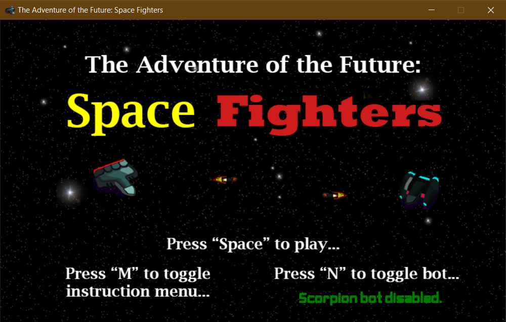

# The Adventure of the Future: Space Fighters

### **[Download for Windows 10/8/8.1](https://github.com/wyiduo/Space_Fighters/releases/download/v1.0.0/Space_Fighters_release.zip)**

### If you are using an older version of Windows, you will need .NET Framework 4.5 (or higher) to run Space Fighters.

---

Space Fighters is a 1-2 player arcade game that borrows gameplay elements from the widely-acclaimed Pong arcade game. Space Fighters adds on to the Pong formula by adding horizontal movement and by having players dodge projectiles instead of catching them.

## How to play

The goal of Space Fighters is to destroy the opponent's spaceship by landing a missile onto them. Once a player destroys the opposing player's ship, that player gets a point, the round ends, and a new round begins. The first person to reach 5 points will win the entire game. If you and your opponent blow each other up at the same time, you both get a point!

### Controls:

Press "m" to view the movement controls. Press "m" again to exit.
Press "n" to enable the AI if you want to play Space Fighters by yourself. Press "n" again to disable the AI.

Press "Space" once you know the controls to get into the action! Press "Esc" at any time to exit the game.

Movement Controls:

**Be careful! Scorpion AI is a cold, battle-hardened veteran. Take no chances with it!** 

## Demo

## Compiling the code

**Dependencies:**
- Visual Studio Community 2017
- MonoGame 3.7.1 for VS
- .NET Framework 4.5 (or higher) **Note: .NET Framework 4.6 is included in Windows 10**

Newer versions of the VS IDE can work, but have not been tested. The Professional and Enterprise versions of the VS IDE can work, but have also not been tested.

Versions of MonoGame newer than MonoGame 3.7.1 can work, but have not been tested.
